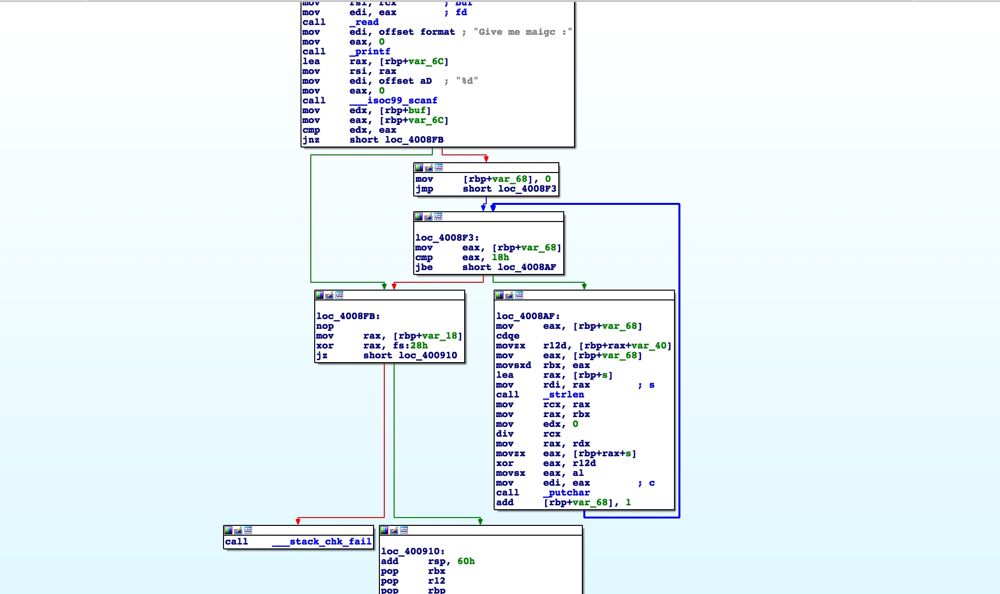
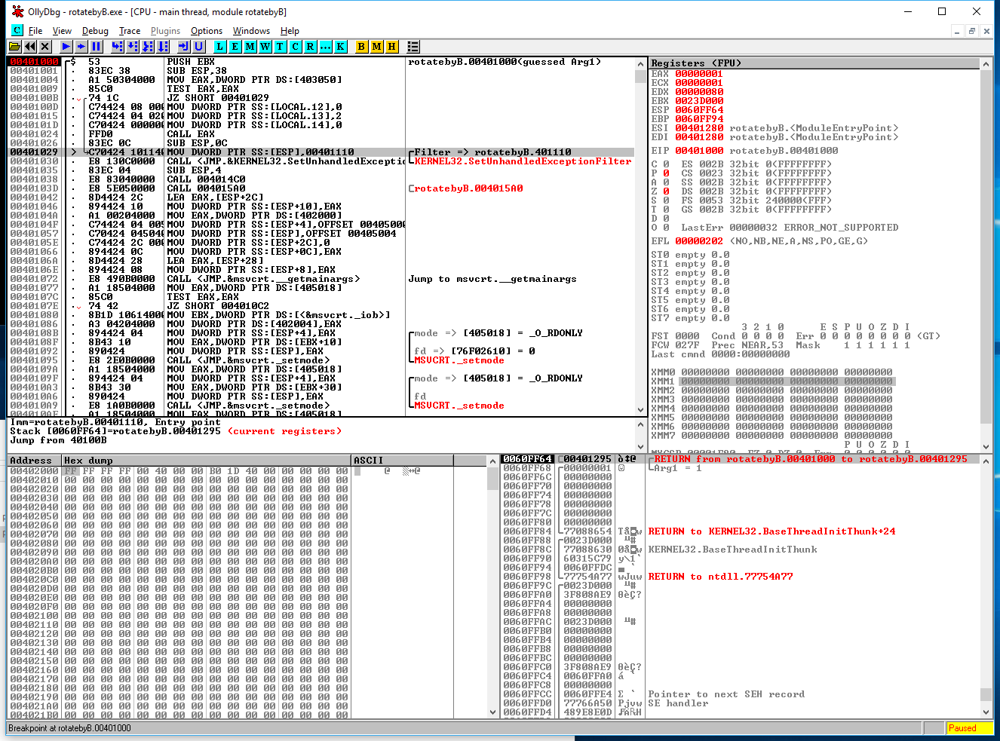
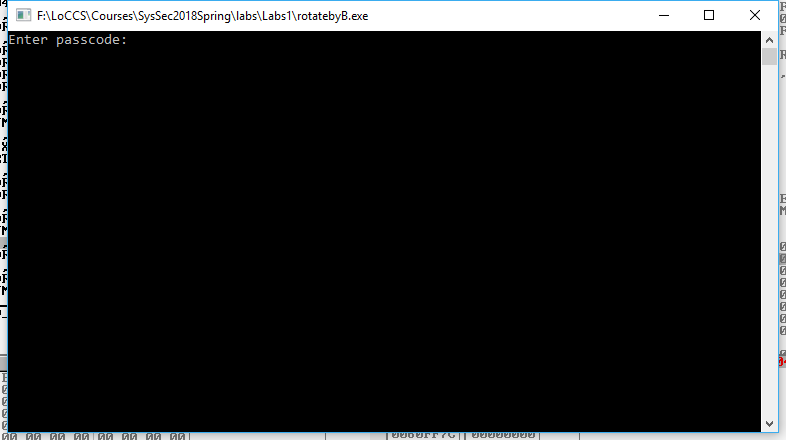

# Lab 1: 逆向分析
实验目的：熟悉Linux和Windows的可执行文件的格式和调试方法。

### 1. ELF 
实验环境：Ubuntu 17.10 amd64
实验工具：GCC、GDB、IDA Pro
实验目的：熟悉Linux环境下的GDB调试
实验代码：

```C
#include <stdio.h>
#include <string.h>
#include <unistd.h>
#include <sys/types.h>
#include <sys/stat.h>
#include <fcntl.h>

void get_flag(){
	int fd ;
	int password;
	int magic ;

	char key[] = "Ban_Ruo_Bo_Luo_Mi!";
	char cipher[] = {6, 14, 49, 6, 61, 0, 48, 19, 43, 4, 58, 19, 33, 7, 54, 62, 54, 102, 35, 12, 11, 96, 109, 74, 101};
	fd = open("/dev/urandom",0);
	read(fd,&password,4);
	printf("Give me maigc :");
	scanf("%d",&magic);
	if(password == magic){
		for(int i = 0 ; i < sizeof(cipher) ; i++){
			printf("%c",cipher[i]^key[i%strlen(key)]);
		}
	}
}

int main(){
	setvbuf(stdout,0,2,0);
	get_flag();
	return 0 ;
}
```

（1）编译并去掉符号表(Q1：试比较有无符号表的区别？)
```
gcc elf.c -o elf
strip ./elf
```
（2）反汇编
将elf拖入ida中观察反汇编的结果(Q2：试分析程序算法)

(3) 动态调试
使用gdb调试（Q3：观察password的值，修改其值，使得程序能打印出secret）

Q4(选做)：你还有什么方式可以得到secret？（Tips，jz与jnz）


### 2. EXE
实验环境: Windows 7及以上
实验工具: OllyDBG
实验目的: 熟悉Windows环境下EXE的调试

(1) 通过OllyDBG熟悉动态调试`rotatebyB.exe`



(2) 分析程序算法，讨论输入什么字符串能够使`rotatebyB.exe`输出`Big Cong!!!`字符串



(3) 通过Q1、Q2的分析，使用Python或者伪代码还原程序主要功能