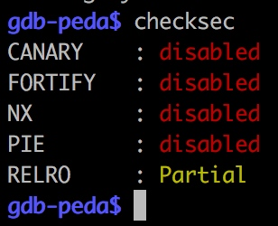
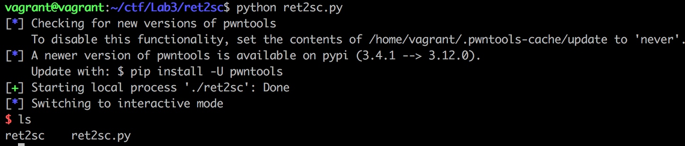
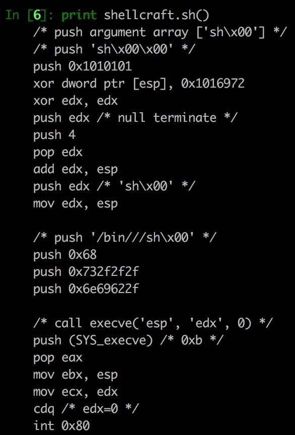
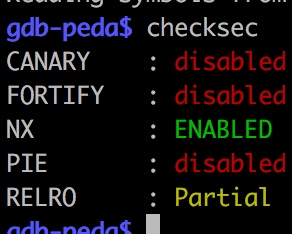
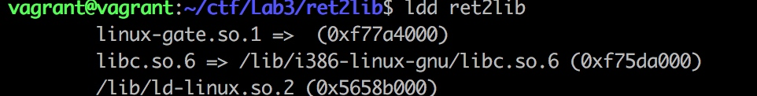

# Lab 3: 漏洞利用

### return to shellcode
实验环境：Ubuntu 17.10 amd64
实验工具：GDB、IDA
实验目的：分析Linux环境下的缓冲区溢出漏洞与shellcode

在课上我们已经熟悉了如何通过栈溢出漏洞控制EIP并跳转到栈中的shellcode地址。在这个实验中，我们尝试在Linux下进一步熟悉这个实验。

经过第一次的实验，相信大家已经熟悉了如何使用IDA静态分析程序和使用GDB动态调试程序，所以本次实验将只提供binary。

你需要完成以下四个小任务。
Q1：使用IDA分析程序的流程

Q2：使用peda的checksec命令查看binary开了哪些保护？
比如NX表示NoneXecutable

Q2：分析程序在何处发生栈溢出，并且使用多长的字符串可以使得eip被完全控制？

Q3：运行ret2sc.py的脚本，并完成利用（你需要安装pwntools）

Q4（选做）：试反汇编ret2sc.py的脚本中的shellcode，并说明shellcode做了什么。

### return to libc
实验环境：Ubuntu 17.10 amd64
实验工具：GDB、IDA

Q1：使用IDA分析ret2lib程序的流程

Q2：使用peda的checksec命令查看binary开了哪些保护？

Q2：使用IDA查看linux系统下的libc中的puts和system的相对偏移
（Tips,/lib/i386-linux-gnu/libc.so.6)

修改脚本中对应的值(每个系统的libc可能不一样)，运行ret2lib.py的脚本，并完成利用

Q3：使用GDB调试程序，分析在控制指针后栈的布局（tips, 在有漏洞函数的ret处下断点）

Q4（选做）：利用ROP的方式完成一个打开文件的操作(Tips, open,read,write)

