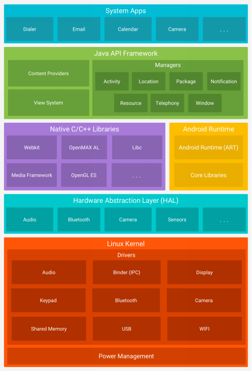
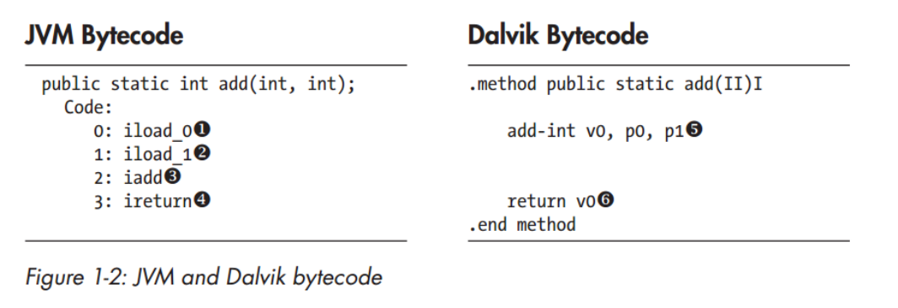
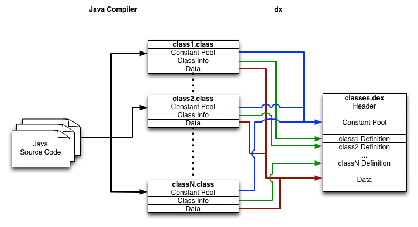
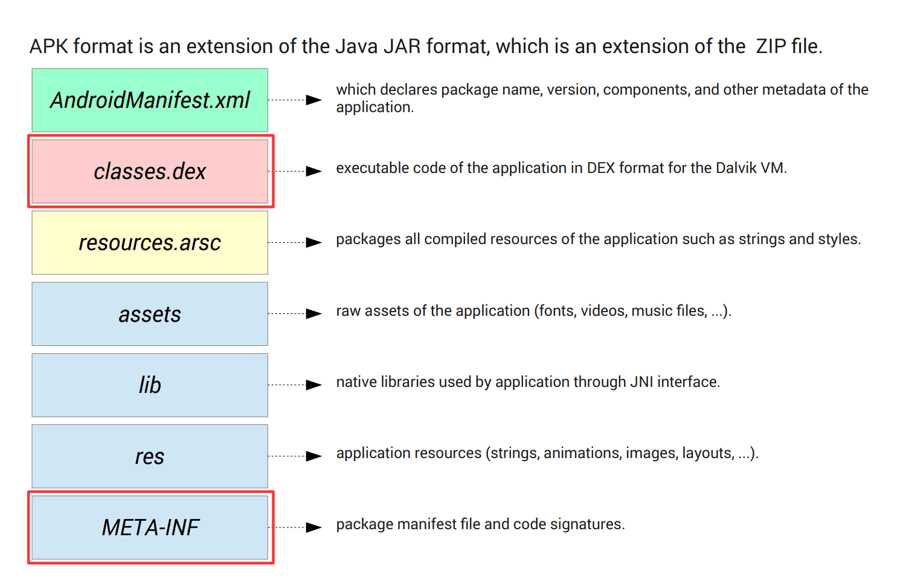
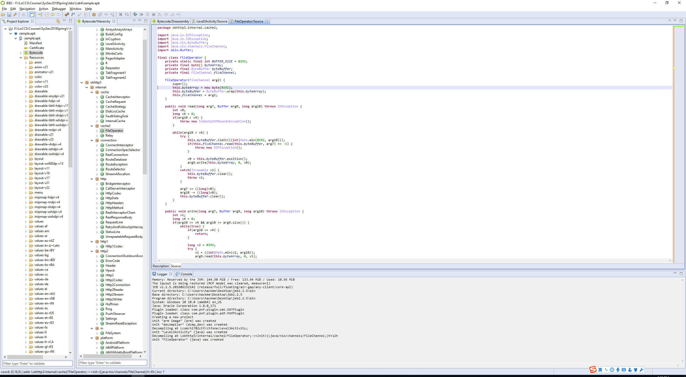

# Lab 4: Android APK 逆向和UPX脱壳
实验目的：熟悉Android平台对APK的逆向分析以及对于使用UPX加壳文件进行脱壳的方法。

## 1. Android APK 逆向

### Android相关背景知识

#### 操作Android

1. 通过手指/鼠标操作屏幕
2. 通过adb（Android Debug Bridge）
   - 需要在设备上开启USB调试

#### Android 系统架构



1. 驱动

   - 用以沟通上层服务和底层硬件（摄像头、传感器等）
   - 漏洞的多发区域

2. Linux 内核

   - 标准Linux内核，根据移动平台的特性进行了定制，添加了诸如共享内存、低内存回收、闹钟等功能
   - 增加了Binder(进程间通信机制)

3. Native Library

   - 提供一些底层接口和功能（/system/lib or lib64）
   - 大多数以ELF(so)的形式存在

4. Android Runtime(Dalvik&ART)

   1. Dalvik
      - Dalvik VM和JVM类似，但是是基于寄存器的VM
      - 运行Dalvik Executable
      - Java代码被编译为dex文件，dex文件在安装时会根据平台特性被优化为Optimized DEX(.odex)，之后在Dalvik上运行
   2. ART
      - ART是新一代的Android应用程序运行环境
      - 用以替代老旧的Dalvik VM
      - 应用程序安装时，dex文件被编译成oat文件，将原有的Dalvik Bytecode编译为汇编代码，直接在CPU上运行
      - ART辅助处理一些库函数调用、字符串、数组等资源的访问操作

5. Android Framework

   - Java运行时库(和标准Java Runtime Lib稍有不同)

   - Android系统服务(adb 下使用service list命令查看)(/system/framework/)

     ​

6. 系统App

   - /system/app、/system/priv-app
   - read-only
   - 以System权限运行

7. 第三方App

   - /data/data/pkg_name/
   - /data/dalvik-cache/{path_name+file_name}@classes.dex
   - 分属不同的UID，拥有自己的权限

#### APK文件格式



- APK本质上是一个ZIP文件，可以直接解压
- 有一些文件经过编译，无法直接查看（证书、AndroidManifest.xml、classes.dex、部分res）

#### APK逆向

##### 逆向与调试工具：

- Apktool
- JEB for bytecode
- IDA for native lib
- GDB, ADB

##### smali/baksmali：

>  smali/baksmali是Android的Java VM实现dalvik使用的dex格式的汇编/反汇编程序。换句话说，dex文件通过baksmali反编译之后得到smali代码，可以说，smali语言是Dalvik的反汇编语言。同样，可以对反汇编得到的smali代码进行插桩等操作之后使用smali重新汇编成dex文件。绝大部分APK分析软件（JEB/apktool）都是基于smali实现的反编译过程。

##### APK修改

- 对于Java代码或者资源文件来说，比较容易实现修改
- 首先使用Apktool解包
- 基于smali代码进行Java代码修改或者直接修改资源文件
- 对于Native代码来说，一般直接patch二进制或者使用hook来实现一些效果
- 修改完成后使用Apktool打包
- 使用Apk-sign签名

##### Native Lib

我们知道，在无论是 Linux，Windows 还是OSX系统，Java平台都允许在 Java 虚拟机 (VM) 内部运行的 Java 代码能够与用其它编程语言（如 C、C++ 和汇编语言）编写的应用程序和库进行交互操作。这种交互的接口属于Java平台的一部分，被称之为JNI（Java Native Interface），可以通过 JNI 调用系统提供的 API。

那么同样在Android平台Google也同样提供了一套可以生成动态链接库的JNI开发和编译工具集（Native Development Kit）。但是NDK提供库有限，通常用于以下场景：需要调用Java无法访问到的系统硬件；对一些开源库的使用避免重复造轮子；隐藏敏感算法防止代码被反编译；方便移植；游戏相关lib等。NDK最终使用Android Studio提供的交叉编译工具生成so文件。

对于已经通过编译生成的so文件放入到相应的工程文件中之后，在Java代码中使用如下方法调用native lib：

```java
System.loadLibrary("hello_jni");
```

则会加载文件名为`libhello_jni.so`的native lib。因此我们可以通过关键方法名定位到在java代码中调用native lib的位置。从而继续分析

> Tip: native lib 中名为`JNI_Onload`的函数前两个参数一定为`JNIEnv * env`和`jobject obj`


### 实验部分

实验环境：Ubuntu 17.10 amd64（其他环境均可）

实验工具：[smali](http://smali.org)、[apktool](https://ibotpeaches.github.io/Apktool/install/)、IDA

实验目的：在提供的sample.apk文件中，有四个flag，找出任意2个flag，并输出报告即可。

> 本实验ddl为Lab5之前。

对于一个apk，我们通常会首先使用`apktool -d sample.apk`对其进行解包，尽管apk文件格式是zip的变种，可以直接使用解压软件解开，但是apk内部的AndroidManifest.xml等文件是没有办法同时解开的。使用apktool进行解包之后会得到同名目录，目录结构通常如下：

```bash
.
├── AndroidManifest.xml #解压之后的xml文本文件
├── apktool.yml			#包含apktool在解压过程中apk相关信息
├── assets				#为apk内部的assets目录
├── lib					#native lib目录
├── original			#包含未解码的AndroidManifest.xml以及签名信息
├── res					#apk的资源文件
└── smali				#对classes.dex反汇编之后的smali文件
```

我们使用apktool虽然只能得到反汇编之后的smali代码，但是这样方便直接对apk中smali进行修改。在一些直接分析程序复杂逻辑不方便的情况下对smali代码进行插桩然后重新使用apktool进行汇编打包签名运行的方式，更方便我们分析程序的功能和逻辑。

在使用apktool对一个apk有初步了解之后，通常会使用JEB等带有反编译功能的静态分析工具分析程序的具体功能。




#### Reference: 

https://bbs.pediy.com/thread-212332.htm

http://smali.org

https://ibotpeaches.github.io/Apktool/install/

https://zhuanlan.zhihu.com/p/25261296

https://github.com/mzlogin/awesome-adb


## 2.UPX脱壳

[UPX]([https://upx.github.io)（the Ultimate Packer for eXecutables）是一款可执行程序文件压缩器。压缩过的可执行文件体积缩小50%-70% ，可以减少了磁盘占用空间、网络上传下载的时间和其它分布以及存储成本。 通过 UPX 压缩过的程序和程序库完全没有功能损失，和压缩之前一样可正常地运行。它支持许多不同的可执行文件格式 ：包含 Windows exe程序和动态链接库、Linux ELF文件和CoreDump文件。

UPX有不光彩的使用记录，因为经常被用来给木马和病毒加壳，躲避杀毒软件的查杀。主要功能是压缩PE文件(比如exe，dll等文件)，有时候也可能被病毒用于免杀。主要用途 ：

1. 让正规文件被保护起来，不容易被修改和破解。
2. 使文件压缩变小。
3. 保护杀毒软件安装程序，使之不受病毒侵害。
4. 木马，病毒的保护外壳，使之难以为攻破。 

### 实现原理

对于可执行程序资源压缩,是保护文件的常用手段，俗称加壳。加壳过的程序可以直接运行,但是不能查看源代码。要经过脱壳才可以查看源代码。加壳其实是利用特殊的算法，对EXE、DLL文件里的资源进行压缩。类似压缩的效果，只不过这个压缩之后的文件，可以独立运行，解压过程完全隐蔽，都在内存中完成。解压原理是加壳工具在文件头里加了一段指令，告诉CPU，怎么才能解压自己。当加壳时，其实就是给可执行的文件加上个外衣。用户执行的只是这个外壳程序。当执行这个程序的时候这个壳就会把原来的程序在内存中解开，解开后，以后的就交给真正的程序。

### 脱壳的中的常见概念

- OEP
  程序入口点，程序最开始执行的地方。
- 原始OEP
  当程序加壳之后，壳会修改程序入口点，会先执行壳代码，会将原程序的入口点隐藏，这里我们把原程序的入口点称为原始OEP。
- dump内存
  将内存中的数据或代码转储(dump)到本地
- IAT
  导入地址表，windows下可执行文件中文件格式中的一个字段，描述的是导入信息函数地址，在文件中是一个RVA数组，在内存中是一个函数地址数组。(关于PE文件相关的知识可以通过搜索引擎查阅一下)
- 修复IAT
  脱壳中比较重要的一步，不论是压缩壳还是加密壳，在脱壳过程中都需要修复IAT，因为脱壳时会将内存中的数据转储(dump)到本地，保存成文件，而IAT在文件中是一个RVA数组，在内存中是一个函数地址数组。我们需要将转储出来的文件中的IAT修复成RVA数组的形式，这样程序才算是恢复。
- 脱壳的环境
  这个单独出来说，主要原因就是不同的系统脱壳时遇到的问题可能是不一样的，因为脱壳时要修改IAT，而不同系统中同一个模块的API导出的顺序是不一样的，所以修复时一般都会出现点问题。

### 脱壳的方法

#### 单步跟踪

分析每一条汇编指令，将壳代码读懂，从而找到原始OEP然后脱壳。这种方法比较困难。即使一个有经验的逆向分析者在对一个陌生的加壳程序分析时也需要花费很多时间。一般这种方法是在逆向时或是不能使用技巧时才会用的方法，需要花费较多的精力和时间。

#### 平衡堆栈

一般加壳程序在运行时，会先执行壳代码，然后在内存中恢复还原原程序，再跳转回原始OEP，执行原程序的代码，我们可以把壳代码理解为一个大的函数，既然是函数，那么进入函数和退出函数时，堆栈应该就是平衡的，基于这样的一种特性，我们可以在壳代码操作了堆栈之后，对堆栈设置访问断点，然后让程序跑起来，当程序暂停的时候，就是壳代码即将执行完的时候，然后在其附近单步跟踪，就可以找到原始OEP了。这种方法比较适用于lab中upx这种只对代码和数据压缩了的壳，如果还对代码和数据加密了，那么就需要结合单步跟踪法。

实验环境：Windows 7 32bit

实验目的：了解upx壳的脱壳过程。

实验要求：在Windows 32位系统下，对于任意exe文件使用upx进行加壳然后使用脱壳工具进行脱壳。

### Reference：

https://github.com/upx/upx/releases/download/v3.94/upx394w.zip

https://down.52pojie.cn/Tools/Unpackers/UPX%20Unpacker.zip

