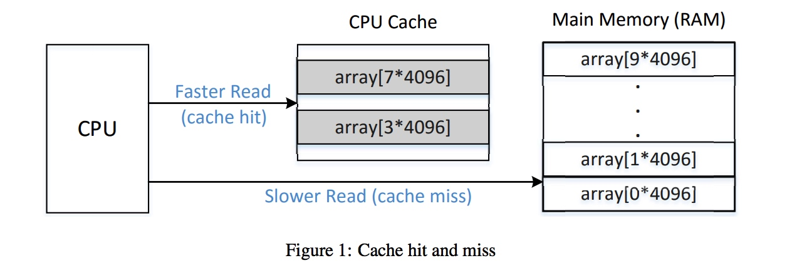
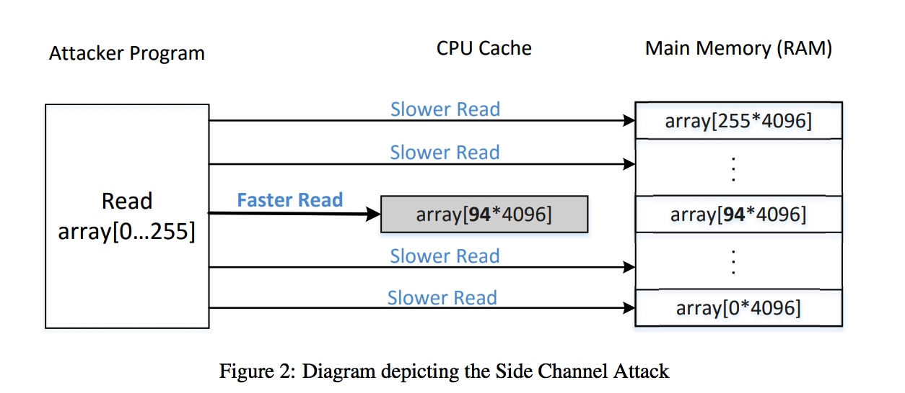
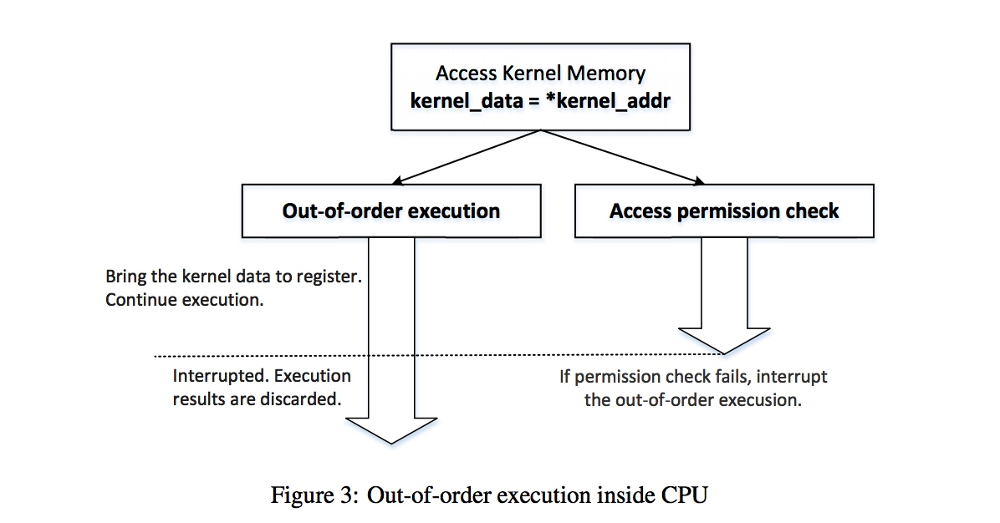
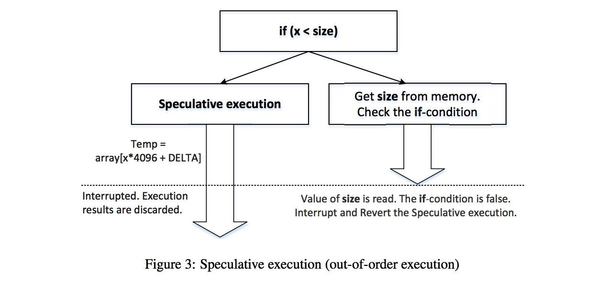
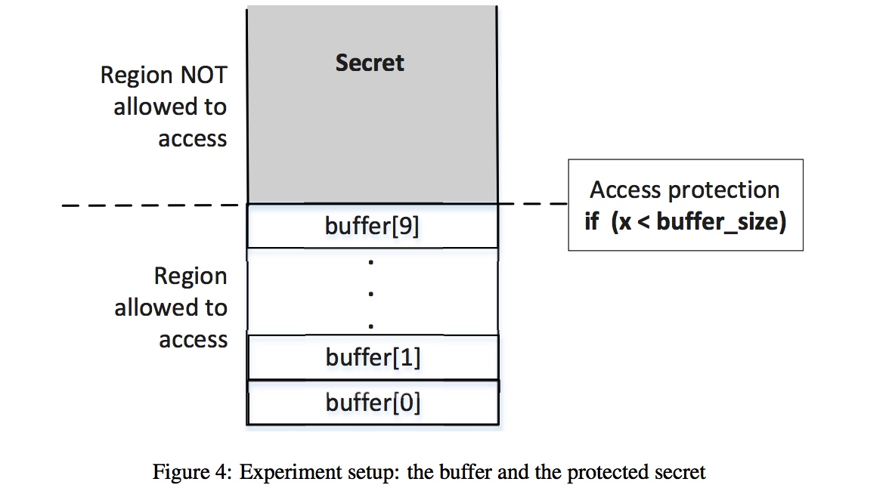

# Lab 6: Meltdown and Spectre

> 2018年1月3日，Google Project Zero（GPZ）团队安全研究员Jann Horn在其团队博客中爆出CPU芯片的两组漏洞，分别是Meltdown与Spectre。[Meltdown](https://meltdownattack.com/)对应CVE-2017-5754（乱序执行缓存污染），[Spectre](https://spectreattack.com/)对应CVE-2017-5753（边界检查绕过）与CVE-2017-5715（分支目标注入）。这两组漏洞早在2017年6月就已经由GPZ团队向英特尔提交，与此同时由Lipp等人发布的论文Meltdown与Spectre Attacks也详细描述了这一攻击，从文中的声明来看，Lipp等人与GPZ团队似乎是独立发现了这两组漏洞。

基于缓存的侧信道攻击目前在学术界研究中非常流行，比如俄亥俄州立大学的Yinqian Zhang教授在此领域做了许多非常杰出的工作。缓存通过数据共享来加快数据访问，也就是说缓存命中与失效对应的响应时间是有差别的，攻击者正是利用这种时间的差异性来推测缓存中的信息，从而获得隐私数据。

## 实验环境
首先确保你的CPU是Intel制造的，并且你的CPU不是最新的，因为Intel已经修复了该漏洞。同时如果你更新了内核，也可能导致实验失败。

在使用gcc编译接下来的代码，你都要加上-march=native这个选项，这样GCC会自动检测你的CPU支持的指令集。
```
$ gcc -march=native -o myprog myprog.c
```


## Meltdown 攻击实验

### 任务1
无论是Meltdown还是Spectre，都是使用了CPU缓存作为边信道来偷取保护的数据。这种攻击技术叫做FLUSH+RELOAD。我们首先了解一下这种攻击手法。

当我们从内存中读取数据时，CPU会把读过的数据存在缓存中。因为从缓存读取的速度比直接从内存中读取数据要快很多。如果当CPU访问内存时，会首先从缓存中查找数据，如果这个数据之前读过就会，就会直接从缓存中读数据，我们称这个过程为cache hit。反之，缓存中没有的话，CPU就会从内存中读数据，我们称这个过程为cache miss。

我们的任务1就是通过代码来观察从缓存和内存中读取数据所用时间的差别。代码见`CacheTime.c`，我们有一个`10*4096大小`的数组，如图所示，首先访问其中的两个`array[3*4096]`，`array[7*4096]`，之后这两组数据就会被缓存到cache中。接下来，我们对`array[0*4096]`到`array[9*4096]`进行读取，来观察每次读取所需要的时间。

(Tips:使用`__rdtscp`获取CPU的时间戳)



不出意外的话，结果很明显
```
vagrant@vagrant:~/kernel/Meltdown_Attack$ gcc -march=native CacheTime.c -o CacheTime
vagrant@vagrant:~/kernel/Meltdown_Attack$ ./CacheTime
Access time for array[0*4096]: 330 CPU cycles
Access time for array[1*4096]: 210 CPU cycles
Access time for array[2*4096]: 222 CPU cycles
Access time for array[3*4096]: 42 CPU cycles
Access time for array[4*4096]: 216 CPU cycles
Access time for array[5*4096]: 213 CPU cycles
Access time for array[6*4096]: 207 CPU cycles
Access time for array[7*4096]: 42 CPU cycles
Access time for array[8*4096]: 210 CPU cycles
Access time for array[9*4096]: 270 CPU cycles
```
Q1:缓存和主存有什么区别？

### 任务2
在这个任务中，我们尝试使用FLUSH+RELOAD的攻击技术获取victim函数中secret的值，代码见`FlushReload.c`，假设victim函数使用secret作为array的下标，并且假设我们事先不知道secret的值，我们通过边信道的方式来得到这个值。

如图，我们首先通过FLUSH确保array不在缓存中，调用victim函数，使得以secret为下标的数据处于缓存中，最后通过RELOAD整个array来比较reload每个元素的时间。通过任务1我们知道，访问处于缓存中的数据的速度会比较快！


注：实验不是百分之百成功，你需要多观察几次。
Q2：这里为什么要把数组的下标乘以4096？

### 任务3 
有了前面的知识，我们就可以实施真实的Meltdown攻击了。我们可能会想，在任务2中，仅仅对自身程序攻击显然是比较弱的，但是如果换一个场景，这种漏洞就会产生更大的威力。在操作系统中，内存隔离是系统安全的基础，具体来说，用户层的程序是不能直接访问内核地址。我们这个任务就是要打破这种安全措施，实现任意读取内核内存的数据。

我们首先通过编写内核模块，在内核中加载一个secret string。

首先安装内核编译依赖的文件
```
sudo apt-get install linux-headers-`uname -r`
vagrant@vagrant:~/kernel/Meltdown_Attack$ ls -al /lib/modules/4.4.0-66-generic/build
lrwxrwxrwx 1 root root 39 Mar  3  2017 /lib/modules/4.4.0-66-generic/build -> /usr/src/linux-headers-4.4.0-66-generic
```

然后通过make来生成MeltdownKernel.ko，再通过insmod安装该内核模块。该内核模块只是简单的把一个string放到内核中。为了简化攻击过程，我们通过dmesg来查看secret string的地址，这里是`0xffffffffc05ca000`
```
vagrant@vagrant:~/kernel/Meltdown_Attack$ make
make -C /lib/modules/4.4.0-66-generic/build M=/home/vagrant/kernel/Meltdown_Attack modules
make[1]: Entering directory '/usr/src/linux-headers-4.4.0-66-generic'
  CC [M]  /home/vagrant/kernel/Meltdown_Attack/MeltdownKernel.o
  Building modules, stage 2.
  MODPOST 1 modules
  CC      /home/vagrant/kernel/Meltdown_Attack/MeltdownKernel.mod.o
  LD [M]  /home/vagrant/kernel/Meltdown_Attack/MeltdownKernel.ko
make[1]: Leaving directory '/usr/src/linux-headers-4.4.0-66-generic'
vagrant@vagrant:~/kernel/Meltdown_Attack$ sudo insmod MeltdownKernel.ko
vagrant@vagrant:~/kernel/Meltdown_Attack$ dmesg | grep 'secret data address'
[426959.705455] secret data address:ffffffffc05ca000
```

如果我们直接从用户态访问`0xffffffffc05ca000`，显然是会失败的，具体可以见代码`MeltdownExperiment.c`，当访问内核地址时，会触发异常。

```
void meltdown(unsigned long kernel_data_addr)
{
  char kernel_data = 0;

  // The following statement will cause an exception
  kernel_data = *(char*)kernel_data_addr;
  array[7 * 4096 + DELTA] += 1;
}
```
Q3：用户态为什么不能直接访问内核态的数据?

### 任务4
根据我们上一步的分析，我们认为以下代码是执行不到第四行的，因为这里对一个内核地址进行解引用会导致异常，从而终止程序的执行。

```
1 number = 0;
2 *kernel_address = (char*)0xffffffffc05ca000;
3 kernel_data = *kernel_address;
4 number = number + kernel_data;
```

早期的处理器依次顺序执行既定的处理器指令，而现代处理器为了提高性能并不严格按照指令的顺序串行执行，而是对执行进行相关性分析后并行处理乱序执行。比如当处理器中的某些指令需要等待某些资源，处理器不会真的在这里等待而停止指令的执行，而是利用等待资源的时间继续执行后续的指令。在乱序执行中，指令并没有真正执行完成而只是加载到缓存中。而此时由于乱序执行而被提前执行的指令会被处理器丢弃，但乱序执行的指令对缓存的操作在这些指令被丢弃时不会被重置。正是安全检查与乱序执行的空窗期才会让Meltdown有机可乘。




再CPU有了乱序执行的能力后，我们再来看这个程序。
我们访问`array[kernel_data * 4096]`，通过乱序执行，以kernel_data为下标的数据会被放到缓存中。再通过FLUSH+RELOAD的技术遍历整个array。这时我们就能通过边信道的方式推测出kernel_data的值。

Q4: 完善`MeltdownAttack.c`程序，使得其能完整打印secret string的内容。


## Spectre 攻击实验

### 任务1

我们再来看如下的代码，如果size=10，当x大于等于10时是执行不到第三行的。但由于乱序执行的原因，是可能会被执行的。

```
1 data = 0;
2 if (x < size) {
3 data = data + 5;
4 }
```
预测执行涉及到程序的控制流，现在处理器不是去解析所有分支指令后然后决定执行哪个操作，而是预测哪个控制流会更有可能被运行再提取相应的指令代码执行。如果预测正确的话，会带来很高的性能提升并提高处理器的并行性。如果预测错误，那些被预测执行的不正确结果会被丢弃，处理器会将状态恢复到预测执行行前的正确状态，再重新跳转到正确执行的分支或指令中运行。与乱序执行类似，预测执行对处理器缓存的操作会被保留。



代码见`SpectreExperiment.c`，

我们通过反复执行正确分支，使得CPU再预测if判断条件时为True。

```
// Train the CPU to take the true branch inside victim()
  for (i = 0; i < 10; i++) {
   _mm_clflush(&size);
   victim(i);
  }
```

这是我们再传入一个大于size的值，让实际执行时进入False，但是因为我们已经把size从缓冲中flush掉，所以从内存中获取size的值需要一段时间，与此同时，因为预测执行的功能，CPU提前执行了True里的代码块。

Q1：这里如果去掉`_mm_clflush(&size);`会怎样？ 

### 任务2

根据任务1的分析，我们可以让CPU执行一个True的分支即使当前的条件为False。Spectre证实利用了这一点来泄露数据。

Spectre可以从当前或其他进程泄露数据。泄露其他进程的危害显然易见，泄露当前进程的数据也可以用来绕过沙盒等。为了简化攻击过程，这个实验从当前进程泄露数据。



代码见`SpectreAttack.c`
`restrictedAccess`限制了该段代码只能访问buffer的数据，如果x超过buffer_size的话就会返回0。我们假设secret的值处于受限的地址，攻击者知道secret的地址，但是只能通过sandbox函数来访问secret。
```
unsigned int buffer_size = 10;
uint8_t buffer[10] = {0,1,2,3,4,5,6,7,8,9};
uint8_t restrictedAccess(size_t x)
{
if (x < buffer_size) {
return buffer[x];
} else {
return 0;
}
}
```

接下来我们通过Spectre攻击来泄露secret的值。代码见`SpectreAttack.c`，`larger_x`计算出`secret`与`buffer`的偏移，在训练CPU进入True预测分支后，CPU会返回`buffer[larger_x]`，secret的值会把array对应的数据缓存到cache中。然后，这些预测的步骤会被回滚，但是对cache的影响没有被回滚。最后，通过边信道技术就可以得知array的哪个数据在缓存中。

Q2: 完善`SpectreAttack.c`程序，使得其能完整打印secret string的内容。

References: http://www.cis.syr.edu/~wedu/seed

